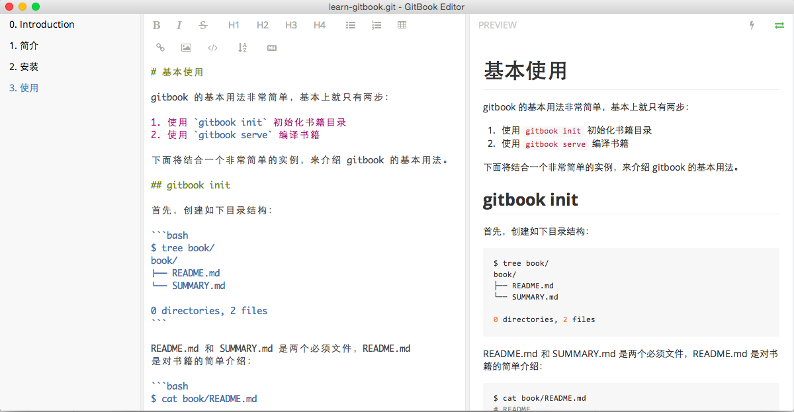

# 1.3 使用说明

## 基本使用

gitbook 的基本用法非常简单，基本上就只有两步：

- 使用 gitbook init 初始化书籍目录
- 使用 gitbook serve 编译书籍

下面将结合一个非常简单的实例，来介绍 gitbook 的基本用法。

正常创建一个gitbook的命令，如下

 1. **gitbook init** 创建gitbook的目录结构
 2. 编辑 **SUMMARY.md**,编写书籍目录
 3.  **gitbook init** 按书籍目录创建对应的章节
 4. 使用**gitbook serve**编译预览,可访问127.0.0.1:4000查看
 
```
gitbook/
├── README.md
└── SUMMARY.md
```


## gitbook init命令


首先，创建如下目录结构：

```
$ mkdir gitbook
$ cd gitbook
$ gitbook init
$ tree gitbook/
gitbook/
├── README.md  #概述
└── SUMMARY.md #目录文件

0 directories, 2 files

```

README.md 和 SUMMARY.md 是两个必须文件，README.md 是对书籍的简单介绍：

```aidl
$ cat gitbook/README.md 
# README

This is a book powered by [GitBook](https://github.com/GitbookIO/gitbook).
```
SUMMARY.md 是书籍的目录结构。内容如下：


```aidl
# 目录

* [前言](README.md)
* [1 安装手册](install/README.md)
    * [1.1 简介](install/introduction.md)
    * [1.2 安装](install/install.md)
    * [1.3 使用说明](install/basic-usage.md)
    * [1.4 GitBook官网介绍](install/gitbook-intro.md)


```

创建了这两个文件后，使用 gitbook init，它会为我们创建 SUMMARY.md 中的目录结构。

```aidl
$ cd gitbook
$ tree
├─.idea
│  └─inspectionProfiles
├─install
```

## gitbook serve 命令

书籍目录结构创建完成以后，就可以使用 ```gitbook serve ``` 来编译和预览书籍了：

```aidl
$ gitbook serve
Press CTRL+C to quit ...

Live reload server started on port: 35729
Starting build ...
Successfully built!

Starting server ...
Serving book on http://localhost:4000
```

gitbook serve 命令实际上会首先调用 gitbook build 编译书籍，完成以后会打开一个 web 服务器，监听在本地的 4000 端口。

现在，可以用浏览器打开 http://127.0.0.1:4000 查看书籍的效果，如下图：


现在，gitbook 为我们创建了书籍目录结构后，就可以向其中添加真正的内容了，文件的编写使用 markdown 语法，在文件修改过程中，每一次保存文件，gitbook serve 都会自动重新编译，所以可以持续通过浏览器来查看最新的书籍效果！

另外，用户还可以下载 [gitbook 编辑器](https://github.com/GitbookIO/editor)，做到所见即所得的编辑，如下图所示：

